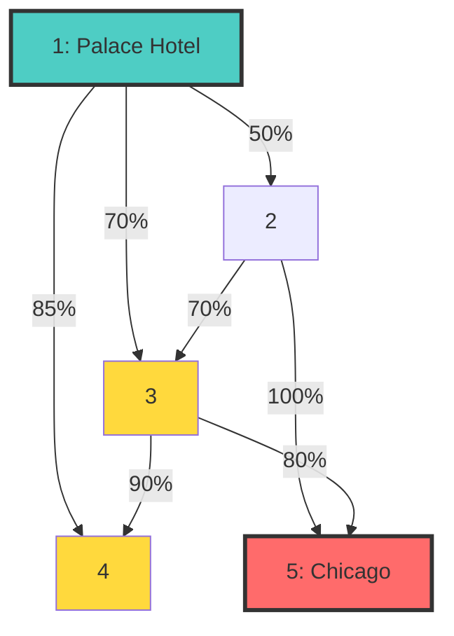
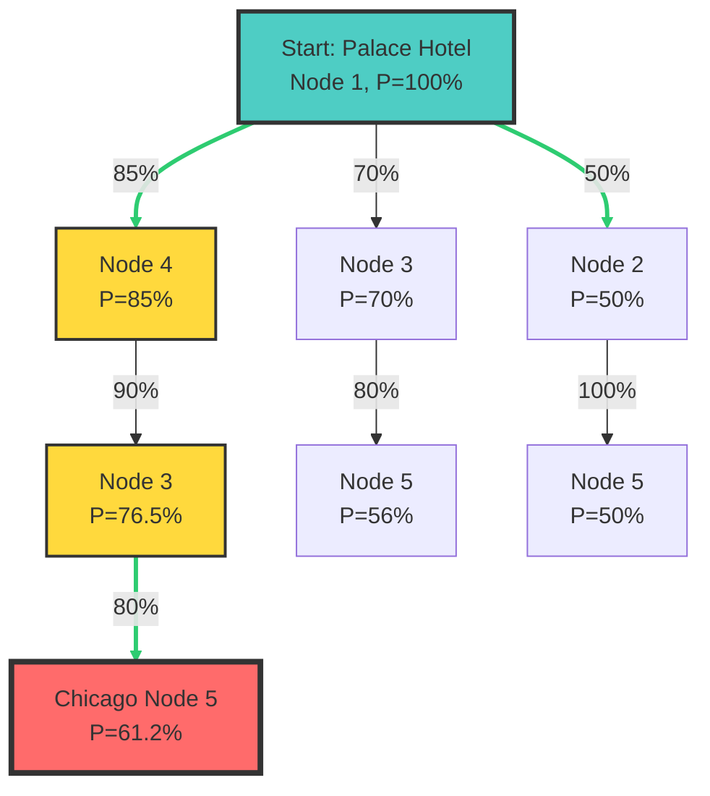

# CHICAGO

## 106 Miles to Chicago

SPOJ - Gráf

<div class="abs-br m-6 flex gap-2">
  <a href="https://www.spoj.com/problems/CHICAGO/" target="_blank" alt="SPOJ"
    class="text-xl slidev-icon-btn opacity-50 !border-none !hover:text-white">
    <carbon:link />
  </a>
</div>

---
transition: fade-out
---

# A történet

### Blues Brothers

<div class="text-sm">

A "Blues Brothers" filmben Elwood és Jake megpróbálják megmenteni árvaházukat azzal, hogy befizetnek **5000 dollárt adóként** a Cook County Assessor's Office-ban, **Chicagóban**.

<v-clicks>

- Miután megkeresték a pénzt a Palace Hotelben, el kell jutniuk Chicagóba
- Üldözik őket
- **106 mérföld** van Chicagóig
- **Sötét** van
- **Napszemüveget** viselnek 😎

**Feladat**: Találd meg a **legbiztonságosabb utat** Chicagóba!

</v-clicks>

</div>

<div v-click class="mt-6 p-4 bg-blue-500 bg-opacity-20 rounded">

**Legbiztonságosabb út** = Az az útvonal, amely **maximalizálja** annak valószínűségét, hogy nem kapják el őket!

</div>

---

# Problem Statement / Feladat

<div class="grid grid-cols-2 gap-6 text-sm">

<div>

### Input

<v-clicks>

- **n** kereszteződések (2 ≤ n ≤ 100)
- **m** utcák (1 ≤ m ≤ n×(n-1)/2)
- Minden utca: **a, b, p**
  - a, b: végpontok
  - p: valószínűség, hogy eljutnak % (1-100)
- Utcák **kétirányúak**
- **Kezdő** pont: 1 (Palace Hotel)
- **Cél** pont: n (Chicago)

</v-clicks>

</div>

<div v-click>

### Output

<v-clicks>

- A**legbiztonságosabb út** biztonságossága
- Formátum: **6 tizedesjegy**
- Példa: `61.200000 percent`

</v-clicks>

<div class="mt-4 p-3 bg-green-500 bg-opacity-20 rounded text-xs">


**Az út biztonságossága** = az úton lévő összes él valószínűségének **szorzata**!

P(út) = P(él₁) × P(él₂) × ... × P(élₙ)

</div>

</div>

</div>

---

# Példa

<div class="grid grid-cols-2 gap-8">

<div>

### Input

```
5 7
5 2 100
3 5 80
2 3 70
2 1 50
3 4 90
4 1 85
3 1 70
0
```

<div class="text-xs mt-4">
5 csomópont, 7 él
</div>

</div>

<div v-click>

### Output

```
61.200000 percent
```

<div class="mt-4 text-sm p-4 bg-purple-500 bg-opacity-20 rounded">

**Legbiztonságosabb út:**

1 → 4 → 3 → 5

**Számítás:**
- 1→4: 85% = 0.85
- 4→3: 90% = 0.90
- 3→5: 80% = 0.80

**P = 0.85 × 0.90 × 0.80 = 0.612 = 61.2%**

</div>

</div>

</div>

---


<div class="grid grid-cols-2 gap-6">

<div>

A példa gráf:



</div>

<div v-click>

<div class="p-4 bg-orange-500 bg-opacity-20 rounded text-sm">

**Lehetséges utak:**

<v-clicks>

- 1 → 2 → 5: 0.50 × 1.00 = **50%**
- 1 → 3 → 5: 0.70 × 0.80 = **56%**
- 1 → 4 → 3 → 5: 0.85 × 0.90 × 0.80 = **61.2%** ✓ 
- 1 → 2 → 3 → 5: 0.50 × 0.70 × 0.80 = **28%**

</v-clicks>

<div v-after class="mt-4 pt-4 border-t border-orange-300">
<strong class="text-green-400">Legjobb út:</strong> 1 → 4 → 3 → 5
</div>

</div>

</div>

</div>

---



<div class="text-center mt-4 text-sm">
<strong>Legjobb út:</strong> 1 → 4 (85%) → 3 (×90% = 76.5%) → 5 (×80% = <span class="text-green-400">61.2%</span>)
</div>

---

# Dijkstra


<v-clicks>

Használjunk **negatív** értékeket a priority queue-ban
- heapq min-heap → automatikusan a legkisebb értéket veszi ki
- Ha -P-t teszünk be, akkor a legnagyobb P-t veszi ki először!

Kövessük nyomon a **maximális valószínűséget** minden csomóponthoz
- `max_probs[i]` = a legjobb ismert valószínűség az i csomóponthoz jutásra
- Kezdetben: `max_probs[1] = 1.0` (100% hogy az 1-es csomópontban vagyunk)

Update szabály
- Ha új út i-be: `new_prob = curr_prob × edge_prob`
- Ha `new_prob > max_probs[i]`: frissítés!

</v-clicks>


---

```python{*}{maxHeight:'420px'}
import sys
import heapq

def solve():
    input_data = sys.stdin.read().split()
    
    if not input_data:
        return

    iterator = iter(input_data)
    
    while True:
        try:
            token = next(iterator)
            if token == '0':
                break
                
            n = int(token)
            m = int(next(iterator)) # Utcák száma
            
            # Szomszédsági mátrix
            adj = [[] for _ in range(n + 1)]
            
            for _ in range(m):
                u = int(next(iterator))
                v = int(next(iterator))
                p_int = int(next(iterator))
                
                p_decimal = p_int / 100.0
                
                adj[u].append((v, p_decimal))
                adj[v].append((u, p_decimal))
            
            # Dijkstra
            max_probs = [-1.0] * (n + 1)
            
            # Palace Hotel
            max_probs[1] = 1.0
            
            pq = [(-1.0, 1)]
            
            while pq:
                curr_p, u = heapq.heappop(pq)
                curr_p = -curr_p
                
                # Ha már van jobb út, nem foglalkozunk vele
                if curr_p < max_probs[u]:
                    continue
                
                if u == n:
                    break
                
                for v, edge_p in adj[u]:
                    new_prob = curr_p * edge_p
                    
                    if new_prob > max_probs[v]:
                        max_probs[v] = new_prob
                        heapq.heappush(pq, (-new_prob, v))
            
            result_percentage = max_probs[n] * 100.0
            print(f"{result_percentage:.6f} percent")

        except StopIteration:
            break

if __name__ == "__main__":
    solve()
```

---
layout: center
class: text-center
---

# Köszönöm a figyelmet!


<div class="mt-8">

[SPOJ](https://www.spoj.com/problems/CHICAGO/)
</div>


