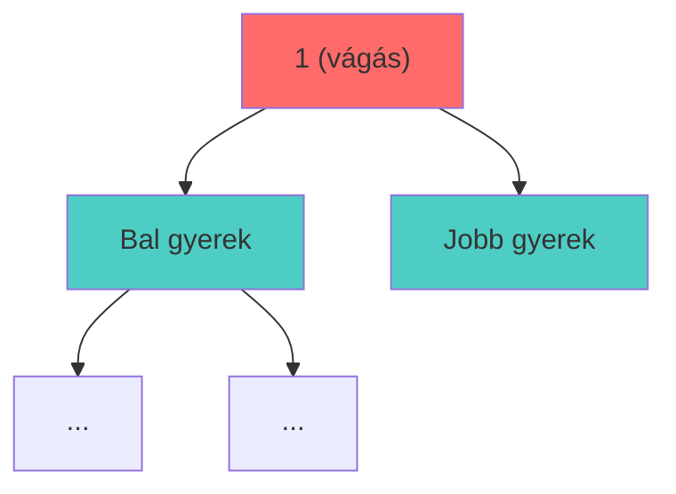

# DYZIO

## Kötélvágási Probléma

SPOJ - Rekurzió


<div class="abs-br m-6 flex gap-2">
  <a href="https://www.spoj.com/problems/DYZIO/" target="_blank" alt="SPOJ"
    class="text-xl slidev-icon-btn opacity-50 !border-none !hover:text-white">
    <carbon:link />
  </a>
</div>

---
transition: fade-out
---

# A Feladat


Dyzio ad egy kötelet Jasieknek, és mellé vágási utasításokat **bináris stringként**:

<v-clicks>

- **'1'** = Vágd ketté a kötelet (fele-fele arányban)
- **'0'** = Ne vágd (ez egy végső darab, kész)
- Az '1' után a következő rész a **bal darabot** írja le, majd a **jobb darabot**
- **Szabály**: Mindig először a bal darabot kell teljesen feldolgozni, csak aztán a jobbot!
- **Cél**: Hány vágás szükséges, amíg elkülönítjük a **legrövidebb darabot**?

</v-clicks>

<div v-click class="mt-6 p-4 bg-blue-500 bg-opacity-20 rounded">

### Korlátok
- 10 teszteset egymás után
- 1 ≤ n ≤ 20,000 (string hossza)
- Időlimit: 1 másodperc

</div>

---

# Példa

<div class="grid grid-cols-2 gap-8">

<div>

### Bemenet (Input)

```
9
110011000
```

<div class="text-sm mt-4">
n = 9 (string hossza)
</div>

</div>

<div v-click>

### Kimenet (Output)

```
4
```

<div class="mt-4 text-sm p-4 bg-green-500 bg-opacity-20 rounded">
<strong>4 vágás</strong> szükséges a legrövidebb darab elkülönítéséhez
</div>

</div>

</div>

---

# A Fa Szerkezet Megértése

A bináris string egy **bináris fa struktúrát** ír le:

<v-clicks>

- Minden csomópont:
  - **'1'**: Belső csomópont (vágás kell)
  - **'0'**: Levél (végső darab)

- A fa **pre-order** sorrendben van kódolva (gyökér, bal, jobb)

- Egy levél **mélysége** = hány vágás kell hozzá eljutni

</v-clicks>

<div v-click class="mt-6">



</div>

---

### Rekurzív Gondolkodás

<v-clicks>

1. **Minden csomópontnak 3 információt kell visszaadnia:**
   - A részfájában található **legnagyobb mélységű** levél mélysége
   - **Hány vágás** történt, amikor ez a levél elkülönült
   - **Hány vágást** fogyasztott el ez a részfa

2. **'0' csomópont (levél):**
   - Mélység = aktuális mélység
   - Nyertes vágásszám = eddigi összes vágás
   - Fogyasztás = 0 (nem vágás)

3. **'1' csomópont (vágás):**
   - Feldolgozzuk bal ágat → kapunk (bal_mély, bal_vágás, bal_fogyasztás)
   - Feldolgozzuk jobb ágat → kapunk (jobb_mély, jobb_vágás, jobb_fogyasztás)
   - Választunk: melyik ágban mélyebb a legnagyobb levél?

</v-clicks>

---

<div class="grid grid-cols-2 gap-8">

<div>

### Időigény

<v-clicks>

- Minden karaktert **pontosan egyszer** látogatunk meg
- **O(n)** ahol n = string hossza
- Max n = 20.000
</v-clicks>

</div>

<div v-click>

### Tárigény

<v-clicks>

- Rekurzió mélysége = fa magassága
- Legrosszabb eset: **O(n)** ferde fánál
- Legjobb eset: **O(log n)** kiegyensúlyozott fánál

**Összesen: O(n)**

</v-clicks>

</div>

</div>


---

# Kód

```python{*}{maxHeight:'400px'}
def solve_recursive(iterator, current_depth, cuts_before_me):
    try:
        char = next(iterator)
    except StopIteration:
        return 0, 0, 0

    if char == '0':
        return (current_depth, cuts_before_me, 0)
    else:
        l_depth, l_win, l_consumed = solve_recursive(
            iterator, current_depth + 1, cuts_before_me + 1)
        r_depth, r_win, r_consumed = solve_recursive(
            iterator, current_depth + 1, cuts_before_me + 1 + l_consumed)
        
        my_total = 1 + l_consumed + r_consumed
        
        if r_depth > l_depth:
            return (r_depth, r_win, my_total)
        else:
            return (l_depth, l_win, my_total)


```

---
layout: center
class: text-center
---

# Köszönöm a Figyelmet!

<div class="mt-8">

[SPOJ Feladat](https://www.spoj.com/problems/DYZIO/)

</div>

