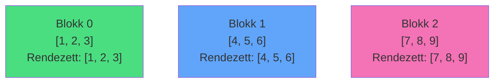

# GIVEAWAY

SPOJ - Bináris keresőfa, adatszerkezet


<div class="abs-br m-6 flex gap-2">
  <a href="https://www.spoj.com/problems/GIVEAWAY/" target="_blank" alt="SPOJ"
    class="text-xl slidev-icon-btn opacity-50 !border-none !hover:text-white">
    <carbon:link />
  </a>
</div>

---
transition: fade-out
---

# A Feladat

Adott egy 1-indexelt **X** tömb N elemmel, és Q lekérdezés két típussal:

<v-clicks>

- **Típus 0**: `0 a b c`
  - Hány elem az **\[a, b\]** intervallumban, ami **≥ c**?
  
- **Típus 1**: `1 a b`
  - Módosíts: **X\[a\] = b**

- **Cél**: Hatékony adatstruktúra, ami gyors lekérdezéseket és módosításokat is támogat

</v-clicks>

<div v-click class="mt-6 p-4 bg-blue-500 bg-opacity-20 rounded">

### Korlátok
- 1 ≤ N ≤ 5×10⁵ (tömb méret)
- 1 ≤ Q ≤ 10⁵ (lekérdezések száma)
- 1 ≤ X[i] ≤ 10⁹
- 1 ≤ c ≤ 10⁹

</div>

---

# Példa

<div class="grid grid-cols-2 gap-8">

<div>

### Bemenet (Input)

```
5
1 2 3 4 5
3
0 1 5 10
1 2 20
0 1 3 10
```

<div class="text-sm mt-4">

- N = 5 elemű tömb
- 3 lekérdezés

</div>

</div>

<div v-click>

### Kimenet (Output)

```
0
1
```

<div class="mt-4 text-sm p-4 bg-green-500 bg-opacity-20 rounded">

**1. lekérdezés**: Hány elem ≥ 10 az \[1,5\] tartományban? → **0**<br>
**2. módosítás**: X\[2\] = 20<br>
**3. lekérdezés**: Hány elem ≥ 10 az \[1,3\] tartományban? → **1** (20)

</div>

</div>

</div>

---

# Brute force


```cpp
// Lekérdezés: O(N)
int query(int a, int b, int c) {
    int count = 0;
    for (int i = a; i <= b; i++) {
        if (arr[i] >= c) count++;
    }
    return count;
}

// Módosítás: O(1)
void update(int a, int b) {
    arr[a] = b;
}
```

**Időigény**: O(Q × N) ❌ Sok idő


---

# Square Root Decomposition

**Ötlet**: Osszuk fel a tömböt **√N méretű blokkokra**

<v-clicks>

- **Blokk méret**: k = √N (pl. N=100 → k=10 blokk)
- Minden blokkban tároljuk az elemeket **rendezve**
- **Módosítás**: O(√N) - egy blokk újrarendezése
- **Lekérdezés**: 
  - Teljes blokkok: **bináris keresés** O(log √N)
  - Részleges blokkok: **lineáris** O(√N)
  - Összesen: O(√N × log √N) ≈ O(√N)

</v-clicks>

<div v-click class="mt-6 p-4 bg-yellow-500 bg-opacity-20 rounded">

### Miért hatékony?
**Összesített komplexitás**: O(Q × √N) ✅

</div>

---
layout: two-cols
---

# Vizualizáció

Eredeti tömb felosztása blokkokra:

<div class="mt-4">

```
Tömb: [1, 2, 3, 4, 5, 6, 7, 8, 9]
N = 9, √N ≈ 3
```

</div>

<div v-click class="mt-4">



</div>

::right::

<div v-click class="ml-8">

### Blokkok előnyei

<v-clicks>

1. **Gyors lekérdezés**: Teljes blokkokon bináris keresés
2. **Gyors módosítás**: Csak egy blokkot kell újrarendezni
3. **Egyszerű implementáció**: std::lower_bound

</v-clicks>

</div>

---

# Adatstruktúra

<v-clicks>

```cpp
int n;                        // Tömb méret
vector<int> arr;              // Eredeti tömb
vector<vector<int>> blocks;   // Rendezett blokkok
int blk_sz;                   // Blokk méret = √N
```

### Inicializálás

```cpp
cin >> n;
arr.resize(n);
blk_sz = sqrt(n);  // Blokk méret
blocks.resize((n + blk_sz - 1) / blk_sz);

for (int i = 0; i < n; i++) {
    cin >> arr[i];
    blocks[i / blk_sz].push_back(arr[i]);  // Blokkhoz adás
}

// Minden blokk rendezése
for (auto& block : blocks) {
    sort(block.begin(), block.end());
}
```

</v-clicks>

---

# Frissítés

**Módosítás**: X\[idx\] = val

<v-clicks>

```cpp {all|2-3|6|9-10|13-14}
void update(int idx, int val) {
    int old_val = arr[idx];
    int b_idx = idx / blk_sz;  // Melyik blokkban van
    
    // 1. Frissítjük az eredeti tömböt
    arr[idx] = val;
    
    // 2. Töröljük a régi értéket a blokkból
    auto it = lower_bound(blocks[b_idx].begin(), 
                         blocks[b_idx].end(), old_val);
    blocks[b_idx].erase(it);
    
    // 3. Beszúrjuk az új értéket (rendezetten)
    auto pos = lower_bound(blocks[b_idx].begin(), 
                          blocks[b_idx].end(), val);
    blocks[b_idx].insert(pos, val);
}
```

**Időigény**: O(√N) - egy blokk frissítése

</v-clicks>

---
layout: two-cols
---

# Lekérdezés - 1 blokkon belül

**Lekérdezés**: Hány elem ≥ c az [l, r] tartományban?

<v-clicks>

```cpp {all|2-3|5-10}
int query(int l, int r, int c) {
    int count = 0;
    int lb = l / blk_sz;  // Bal blokk
    int rb = r / blk_sz;  // Jobb blokk
    
    if (lb == rb) {
        // Egy blokkon belül: lineáris
        for (int i = l; i <= r; i++) {
            if (arr[i] >= c) count++;
        }
        return count;
    }
    // ...
}
```

</v-clicks>

::right::

<div v-click class="ml-8">

### Vizualizáció


Ha `lb == rb`, akkor az egész tartomány **egy blokkon belül** van

</div>

---

# Lekérdezés - több blokkon át

**Több blokk esetén**: Három részre bontjuk

<v-clicks>

```cpp {all|2-5|7-11|13-17}
    // Bal oldali csonka blokk (lineáris)
    for (int i = l; i < (lb + 1) * blk_sz; i++) {
        if (arr[i] >= c) count++;
    }
    
    // Köztes teljes blokkok (bináris keresés!)
    for (int i = lb + 1; i < rb; i++) {
        // lower_bound megadja az első elem indexét ami >= c
        // end() - lower_bound = hány elem >= c
        count += blocks[i].end() - 
                 lower_bound(blocks[i].begin(), blocks[i].end(), c);
    }
    
    // Jobb oldali csonka blokk (lineáris)
    for (int i = rb * blk_sz; i <= r; i++) {
        if (arr[i] >= c) count++;
    }
```

**Időigény**: O(√N + (rb - lb) × log √N) ≈ O(√N × log √N)

</v-clicks>

---

# A teljes kód

```cpp
#include <iostream>
#include <vector>
#include <algorithm>
#include <cmath>

using namespace std;

int n;
vector<int> arr;
vector<vector<int>> blocks;
int blk_sz; 

void update(int idx, int val) {
    int old_val = arr[idx];
    int b_idx = idx / blk_sz;
    
    arr[idx] = val;
    
    auto it = lower_bound(blocks[b_idx].begin(), blocks[b_idx].end(), old_val);
    blocks[b_idx].erase(it);
    
    auto pos = lower_bound(blocks[b_idx].begin(), blocks[b_idx].end(), val);
    blocks[b_idx].insert(pos, val);
}

int query(int l, int r, int c) {
    int count = 0;
    int lb = l / blk_sz;
    int rb = r / blk_sz;
    
    if (lb == rb) {
        for (int i = l; i <= r; ++i) {
            if (arr[i] >= c) count++;
        }
    } else {
        for (int i = l; i < (lb + 1) * blk_sz; ++i) {
            if (arr[i] >= c) count++;
        }
        
        for (int i = lb + 1; i < rb; ++i) {
            count += blocks[i].end() - lower_bound(blocks[i].begin(), blocks[i].end(), c);
        }
        
        for (int i = rb * blk_sz; i <= r; ++i) {
            if (arr[i] >= c) count++;
        }
    }
    return count;
}

int main() {
    ios_base::sync_with_stdio(false);
    cin.tie(NULL);
    
    if (!(cin >> n)) return 0;
    
    arr.resize(n);
    blk_sz = sqrt(n);

    
    blocks.resize((n + blk_sz - 1) / blk_sz);
    
    for (int i = 0; i < n; ++i) {
        cin >> arr[i];
        blocks[i / blk_sz].push_back(arr[i]);
    }
    
    for (int i = 0; i < blocks.size(); ++i) {
        sort(blocks[i].begin(), blocks[i].end());
    }
    
    int q;
    cin >> q;
    
    while (q--) {
        int type;
        cin >> type;
        if (type == 0) {
            int a, b, c;
            cin >> a >> b >> c;
            cout << query(a - 1, b - 1, c) << "\n";
        } else {
            int a, b;
            cin >> a >> b;
            update(a - 1, b);
        }
    }
    
    return 0;
}
```

--- 

<v-clicks>

### Időigény

| Művelet | Brute Force | Sqrt Decomposition |
|---------|------|-------------------|
| **Inicializálás** | O(N) | O(N log √N) |
| **Frissítés** | O(1) | O(√N) |
| **Lekérdezés** | O(N) | O(√N log √N) |
| **Q lekérdezés** | O(Q×N) | O(Q×√N log √N) |

### Tárigény

- **Eredeti tömb**: O(N)
- **Blokkok**: O(N) - minden elem szerepel egy blokkban is
- **Összesen**: O(N)

</v-clicks>

---
layout: center
class: text-center
---


# Köszönöm a figyelmet!


<div class="abs-br m-6 flex gap-2">
  <a href="https://www.spoj.com/problems/GIVEAWAY/" target="_blank" alt="SPOJ"
    class="text-xl slidev-icon-btn opacity-50 !border-none !hover:text-white">
    <carbon:link />
  </a>
</div>
